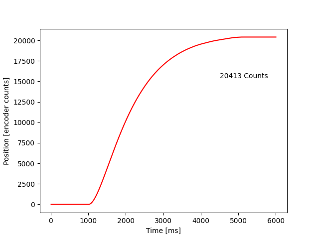

# Lab 2: Developing A Motor Controller

In this lab, we develop a motor controller which can interface
with an optical encoder and a permanent magnet direct current (PMDC or DC)
motor.

Within the main file, when doing a step response analysis of the motor
which we will see below, an input Kp is prompted. Then cycles of the motor
controller updating itself with data from the encoder, and passing the 
desired duty cycle into the motor periodically, about 100 times a second (100Hz).
This is 10ms between each cycle.

First, in a cycle of updating the motor within the main.py file, the
encoder is first read to determine the position of the system. The position
for this assignment is in a unit of Counts because of the two different
motors we were using. The encoder has 1000 counts per revolution. So with
the 16:1 gearbox, there will be 16000 counts for 1 revolution. The
motor with a plastic flywheel has no gearbox so it has 1000 Counts per 
Revolution.

Then, this 

